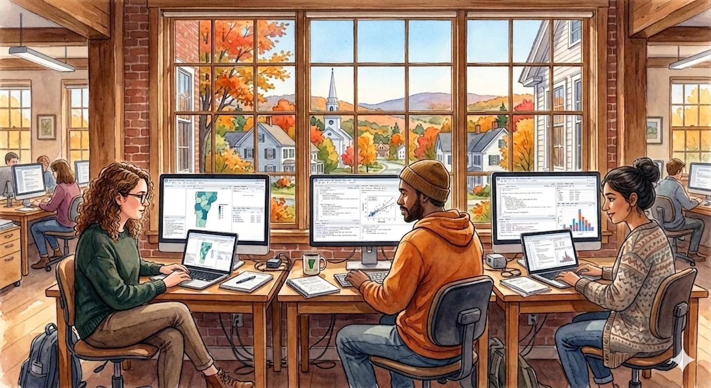

# Applied Data Science & Visualization

**CDAE 7990 · Fall 2026**
University of Vermont, Department of Community Development & Applied Economics

> [!WARNING]
> **DRAFT — Incomplete. Do not distribute.**



Course website built with [Quarto](https://quarto.org), deployed via GitHub Pages at [andrewvanleuven.github.io/uvm_datasci](https://andrewvanleuven.github.io/uvm_datasci).

## Repo Structure

```
/
├── _quarto.yml         # site config
├── index.qmd           # course home / syllabus overview
├── schedule.qmd        # full schedule with links to slides/readings
├── syllabus.qmd        # full syllabus
├── project.qmd         # NBRC project description and team assignments
├── slides/             # weekly revealjs presentations
├── assignments/        # homework descriptions
└── data/               # shared datasets for exercises
```

## Instructor

Andrew Van Leuven, Assistant Professor
[andrew.vanleuven@uvm.edu](mailto:andrew.vanleuven@uvm.edu)
