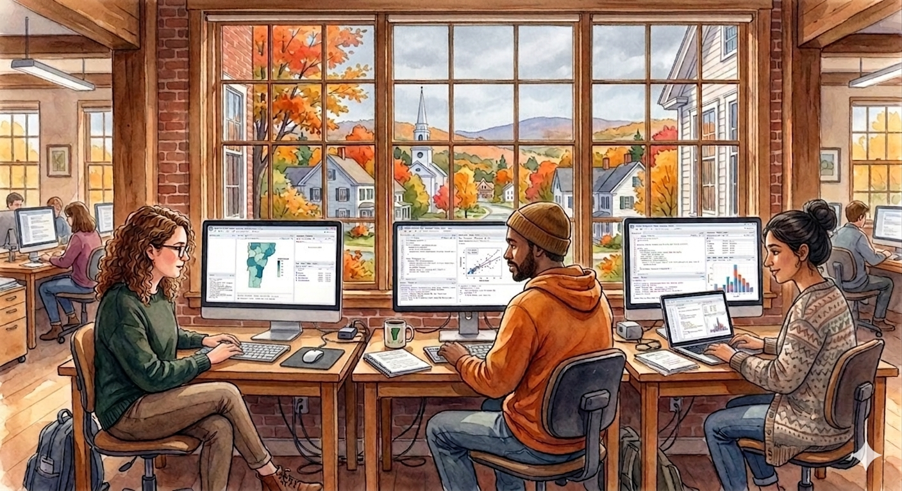

{fig-alt="Students working at computers in a Vermont classroom in autumn" .img-fluid style="border-radius: 6px; margin-bottom: 1.5rem;"}

## Course Overview

This course introduces students to data science and visualization as tools for understanding complex social, economic, and environmental questions. Students learn R for data wrangling, spatial analysis, and reproducible reporting, with an emphasis on producing work that is useful to real audiences.

A core component is a semester-long applied project delivered to an external community partner.

---

## Logistics

| | |
|---|---|
| **Instructor** | Andrew Van Leuven, Assistant Professor |
| **Department** | Community Development & Applied Economics (CDAE), UVM Extension |
| **Meets** | Thursdays, 4:35–7:35 pm |
| **Semester** | Fall 2026 |
| **Credit Hours** | 3 |
| **Office Hours** | By appointment |
| **Office Location** | 209AA Morrill Hall |
| **Computing** | [Posit Cloud](https://posit.cloud) |
| **Primary language** | R |

---

## Textbook

We follow [*R for Data Science* (2nd ed.)](https://r4ds.hadley.nz/) by Hadley Wickham, Mine Çetinkaya-Rundel, and Garrett Grolemund — available free online.

---

## Course Units

| Unit | Weeks | Theme |
|---|---|---|
| 1 | 1–5 | Foundations: R, tidyverse, EDA, ggplot2 |
| 2 | 6–7 | Community Partnership: NBRC campus visit + project launch |
| 3 | 8–9 | Spatial Analysis: GIS, Census data, cartography |
| 4 | 10 | Communication: Quarto reports, slides, dashboards |
| 5 | 12, 14–16 | Project: workdays, critique, final presentations |

---

## Community Partner

This semester's applied project is completed in partnership with the [Northern Border Regional Commission (NBRC)](https://www.nbrc.gov), a federal-state economic and community development commission serving rural northern Maine, New Hampshire, New York, and Vermont.

See the [Project page](project.qmd) for team assignments and deliverables.

---

*Full course policies, grading, and expectations are on the [Syllabus](syllabus.qmd) page.*
