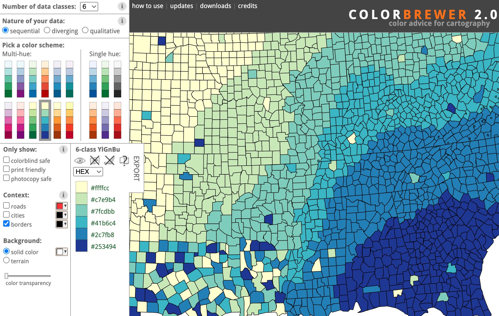
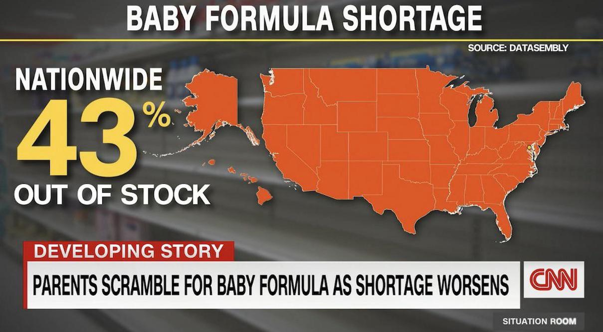
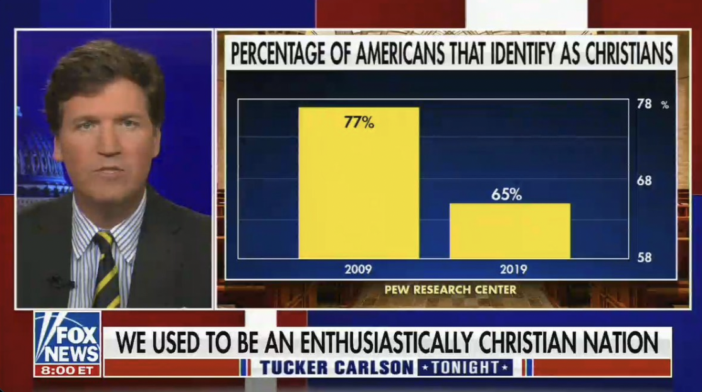
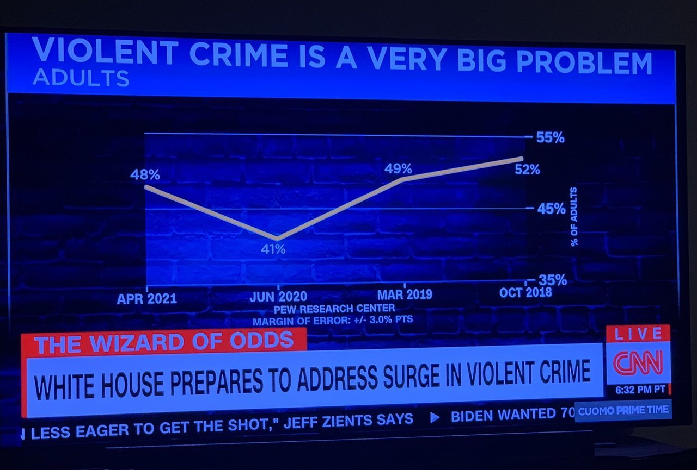
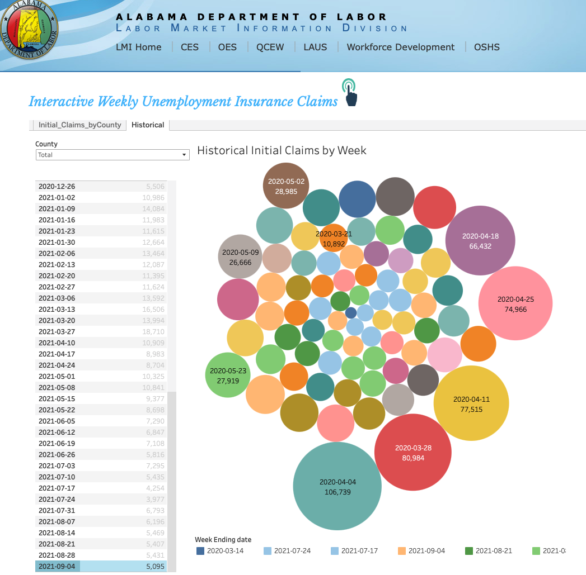

```{r}
#| include: false
library(tidyverse)
options(pillar.print_max = 5, pillar.print_min = 5, width = 72)
# A little extra right margin keeps axis labels like "50%" from being clipped.
wide_margin <- theme(plot.margin = margin(5.5, 22, 5.5, 5.5))
theme_set(theme_gray(base_size = 16) + wide_margin)
knitr::opts_chunk$set(fig.width = 8, fig.height = 4.5, fig.align = "center",
                      dpi = 150, out.width = "85%")

# Complete themes reset the base font size to 11, which is too small on a
# projector. These wrappers keep the code on the slides clean (a bare
# theme_minimal()) while rendering at the same size as every other figure.
theme_minimal <- function(base_size = 16, ...) ggplot2::theme_minimal(base_size = base_size, ...) + wide_margin
theme_classic <- function(base_size = 16, ...) ggplot2::theme_classic(base_size = base_size, ...) + wide_margin
theme_bw <- function(base_size = 16, ...) ggplot2::theme_bw(base_size = base_size, ...) + wide_margin
theme_dark <- function(base_size = 16, ...) ggplot2::theme_dark(base_size = base_size, ...) + wide_margin
```

## Welcome Back

- Last week's figures were for *our* eyes: quick, unlabeled, and good enough to learn what's in the data
- Tonight's figures are for someone else (i.e., stakeholders), so the choices start to matter: which geom, which colors, which axis, and what to leave out
- No homework is due this week. HW3 isn't due until Oct. 25, and I'll tell you when it's released.
- We have a guest tonight, so we'll start there

## Today's Plan

- **Meet Tessa**
- **What else can ggplot do?** More geoms, scales, color, and themes
- **Best practices in visualization**: what makes a figure work, and how figures mislead
- **Your turn**: fix a bad plot
- Tessa and I both have a hard stop at 6:30, so if we're short on time, **Your Turn** becomes self-guided

# Meet Tessa {background-color="#007155"}

# What Else Can ggplot Do? {background-color="#007155"}

## Tonight's Data {.smaller}

```{r}
midwest_df <- midwest |>
  select(county, state, poptotal, popdensity, percollege,
         percbelowpoverty, inmetro) |>
  mutate(metro = if_else(inmetro == 1, "Metro", "Nonmetro"))

midwest_df
```

- The same 437 Midwestern counties as last week, with the readable `metro` column already added
- We'll also borrow `economics`, a second dataset built into ggplot2, because `midwest` has no time dimension
- The template hasn't changed: data, aesthetics, geoms. Everything tonight is a new piece to plug into it.

## Lines: Change Over Time {.smaller}

```{r}
ggplot(economics, aes(x = date, y = unemploy)) +
  geom_line()
```

- `economics` has one row per month of US data from 1967 to 2015. `unemploy` is the number of unemployed people, in thousands.
- `geom_line()` connects the observations in order along the x-axis. Reach for it when x is time.
- The peak is 15.4 million people in October 2009

## One Year, Crowded Axis {.smaller}

```{r}
#| layout-ncol: 2
#| fig-width: 6
#| fig-height: 3
#| out-width: "100%"
unemploy_2009 <- economics |>
  filter(date >= "2009-01-01", date <= "2009-12-01") |>
  mutate(month = month(date, label = TRUE, abbr = FALSE))

ggplot(unemploy_2009, aes(x = month, y = unemploy)) +
  geom_col()

ggplot(unemploy_2009, aes(x = month, y = unemploy)) +
  geom_col() +
  theme(axis.text.x = element_text(angle = 45, hjust = 1))
```

- 2009 was the peak year from the last slide. Twelve full month names at the default angle run into each other.
- `theme(axis.text.x = element_text(angle = 45, hjust = 1))` rotates just the x-axis text. `hjust` keeps the rotated labels lined up under their bars.
- Axis text, titles, and ticks are all controlled through `theme()`, one `element_text()` at a time

## Bubbles: A Third Variable {.smaller}

```{r}
ggplot(midwest_df, aes(x = percollege, y = percbelowpoverty, size = poptotal)) +
  geom_point(alpha = 0.4)
```

- `size` is another aesthetic. It maps a number to the area of each point instead of a position or a color.
- Bigger circles are more populous counties, and Cook County (Chicago) jumps out immediately
- Three numeric variables on one scatterplot, with no new geom. Just one more mapping inside `aes()`.

## Densities: Comparing Distributions {.smaller}

```{r}
ggplot(midwest_df, aes(x = percollege, fill = metro)) +
  geom_density(alpha = 0.5)
```

- A density is a smoothed histogram. It makes two overlapping groups much easier to compare than two stacked histograms.
- Each curve has the same area, so 150 metro counties and 287 nonmetro counties can be compared directly
- Nonmetro counties bunch up around 15%. Metro counties sit higher and spread much wider.

## Text and Highlighting {.smallest}

```{r}
high_poverty <- midwest_df |>
  filter(percbelowpoverty > 30) |>
  mutate(county = str_to_title(county))

ggplot(midwest_df, aes(x = percollege, y = percbelowpoverty)) +
  geom_point(color = "gray70") +
  geom_point(data = high_poverty, color = "#007155", size = 3) +
  geom_text(data = high_poverty, aes(label = county), hjust = 0, nudge_x = 1, size = 5)
```

- A layer can use its own data. The gray points are every county, and the green points and labels come from `high_poverty` (last week's three unusual values).
- `geom_text()` needs a `label` aesthetic. `hjust` and `nudge_x` move the text off the point.
- Gray for context plus one color for the story is one of the most useful tricks in the whole package
- When a layer draws from a different data frame than the one in `ggplot()`, you have to name it with `data =`. Leave that out and the layer uses `midwest_df` again.

## Scales: Controlling the Axes {.smallest}

```{r}
ggplot(midwest_df, aes(x = percollege, y = percbelowpoverty)) +
  geom_point(alpha = 0.4) +
  scale_x_continuous(labels = scales::label_percent(scale = 1)) +
  scale_y_continuous(labels = scales::label_percent(scale = 1),
                     breaks = seq(0, 50, by = 10))
```

- Every aesthetic has a scale, and ggplot picks a default for each. The functions are named `scale_<aesthetic>_<type>()`.
- `labels` controls how the numbers are written and `breaks` controls where the ticks go
- `scale = 1` because our data is already 0 to 100. Without it, `label_percent()` assumes proportions and would print 2,000%.
- Other helpers we might want: `label_comma()` and `label_dollar()`
- `scales::label_percent()` borrows one function from the scales package without a `library(scales)` at the top. The `package::function()` form is handy for a one-off like this.

## A Quick Note on Color {.smaller}

::: {.columns}

::: {.column width="55%"}
- Today's colors are placeholders. Color is a design choice like any other, and we'll come back to it when we cover best practices
- Palettes generally come in three types: **sequential** (low to high), **diverging** (two directions from a meaningful middle), and **qualitative** (categories, no order)
- Click the screenshot to open the real tool
:::

::: {.column width="45%"}
[](https://colorbrewer2.org/){fig-align="center"}

*ColorBrewer*
:::

:::

## Color Scales: Categories {.smaller}

```{r}
ggplot(midwest_df, aes(x = percollege, y = percbelowpoverty, color = metro)) +
  geom_point(alpha = 0.6) +
  scale_color_manual(values = c("Metro" = "#f35d00", "Nonmetro" = "gray60"))
```

- Color is an aesthetic, so it has a scale too. `scale_color_manual()` lets you name the color for each category.
- Don't want to pick colors yourself? `scale_color_brewer(palette = "Dark2")` uses a ready-made palette.
- Points and lines take `color`. Bars, boxes, and densities take `fill`, so their scales are `scale_fill_*()`.

## Color Scales: Continuous Values {.smaller}

```{r}
ggplot(midwest_df, aes(x = popdensity, y = percollege, color = percbelowpoverty)) +
  geom_point() +
  scale_x_log10(labels = scales::label_comma()) +
  scale_color_viridis_c(option = "magma", direction = -1)
```

- A number mapped to color needs a gradient that runs from light to dark in one direction
- The viridis palettes (`"viridis"`, `"magma"`, `"plasma"`, and others) do that, and they stay readable in grayscale and for color-blind readers
- `direction = -1` flips the palette so that dark means high

## Themes {.smaller}

```{r}
#| layout-ncol: 2
#| fig-width: 6
#| fig-height: 3 
#| out-width: "100%"
ggplot(midwest_df, aes(x = percollege, y = percbelowpoverty)) +
  geom_point(alpha = 0.4) +
  theme_minimal()

ggplot(midwest_df, aes(x = percollege, y = percbelowpoverty)) +
  geom_point(alpha = 0.4) +
  theme_classic()
```

- A theme controls the background, gridlines, fonts, and legend placement. It never touches the data.
- The gray default is `theme_gray()`. Also built in: `theme_bw()`, `theme_light()`, and `theme_void()` (nothing at all, which is what we'll use for maps).
<!-- - Tired of adding it to every plot? Run `theme_set(theme_minimal())` once at the top of your document. -->

##  A Finished Visualization {.smallest}

```{r}
#| label: finished-chart
#| fig-show: hide
ggplot(midwest_df, aes(x = percollege, y = percbelowpoverty, color = metro)) +
  geom_point(alpha = 0.6) +
  scale_color_manual(values = c("Metro" = "#007155", "Nonmetro" = "gray60")) +
  scale_x_continuous(labels = scales::label_percent(scale = 1)) +
  scale_y_continuous(labels = scales::label_percent(scale = 1)) +
  labs(
    title = "The most college-educated counties are metro counties",
    subtitle = "Midwestern counties, 2000 Census",
    x = "Adults with a college degree",
    y = "Population below poverty line", 
    color = NULL,
    caption = "Source: ggplot2::midwest"
  ) +
  theme_minimal(base_family = 'Tahoma') +
  theme(legend.position = "bottom",
        axis.title = element_text(face = 'bold'))
```

- Nothing new here. It's tonight's pieces stacked on last week's scatterplot: a color scale, two axis scales, labels, and a theme.
- `theme()` adjusts one element at a time, on top of whichever complete theme you chose
- Of the 24 counties where more than 30% of adults have a degree, 21 are metro

## {#finished-chart-figure}

<!-- Re-runs the finished-chart chunk above so the figure gets a slide to itself. Edit the code there, not here. -->

```{r}
#| ref.label: finished-chart
#| echo: false
#| fig-width: 9
#| fig-height: 5.6
#| out-width: "100%"
```

## Break? {background-color="#007155"}

# Best Practices in Visualization {background-color="#007155"}

## You Read Far More Figures Than You Make {.smaller}

Tonight's reading suggests four questions to ask of any figure, whether it's yours or someone else's:

1. **What do you see?** Sum up the main takeaway in one sentence.
2. **Who created it?** The source often tells you what the figure is for.
3. **Are you being tricked?** Look at the axes, the scales, and the sizes.
4. **What is missing?** Ask what data or context was left out.

When something is off, Wilke's three words help you say *how* it's off:

- **Ugly**: an aesthetic problem, like clashing colors or distracting fonts
- **Bad**: a perception problem. The figure is hard to read.
- **Wrong**: an accuracy problem. The figure misstates the data.

## Exhibit A: What's Wrong Here? {.smaller}

{fig-align="center" height="520" fig-alt="CNN map of the United States, entirely orange, captioned 43 percent out of stock nationwide during the baby formula shortage"}

*Source: CNN,* The Situation Room

## Exhibit B: What's Wrong Here? {.smaller}

{fig-align="center" height="520" fig-alt="Fox News figure showing the percentage of Americans identifying as Christian, 2009 versus 2019"}

*Source: Fox News,* Tucker Carlson Tonight

## Exhibit C: What's Wrong Here? {.smaller}

{fig-align="center" height="520" fig-alt="CNN line chart titled Violent Crime Is a Very Big Problem, with four dates on the x-axis: April 2021, June 2020, March 2019, October 2018"}

*Source: CNN,* Cuomo Prime Time

## Exhibit D: What's Wrong Here? {.smaller}

{fig-align="center" height="520" fig-alt="Alabama Department of Labor dashboard showing weekly unemployment claims as randomly packed, color-coded circles"}

*Source: Alabama Department of Labor*

# Rules to Guide the Visualization Process {background-color="#007155"}

## {background-image="../img/tree.png" background-size="contain"}

## Rule 1: Start With the Question {.smaller}

Before picking a geom, ask what you are trying to show. The reading's decision tree (Figure 1) has four branches, plus maps:

- **Distribution**: how values are spread out (histogram, density, boxplot)
- **Composition**: how a whole divides into parts (stacked bars or a waffle plot, rarely a pie)
- **Relationship**: how variables move together (scatterplot)
- **Comparison**: how groups or time periods differ (bar chart, line chart)
- **Geography**: *where* something happens (maps, starting in Week 8)

The same data can sit on more than one branch. We'll spend more time on choosing a chart type in a few weeks.

## Rule 2: Show the Data {.smallest}

> "Above all else show the data."
>
> — Edward Tufte

Tufte's five principles from *The Visual Display of Quantitative Information*:

1. Above all else, show the data
2. Maximize the data-ink ratio
3. Erase non-data-ink
4. Erase redundant data-ink
5. Revise and edit

- **Data-ink** is the part of a figure that actually represents data. Everything else is non-data-ink: borders, backgrounds, heavy gridlines, and decoration that Tufte calls *chartjunk*.
- You don't have to be as strict as Tufte. The useful habit is asking of every element, "what is this doing for the reader?"

## Same Five Numbers, Less Ink {.smaller}

```{r}
#| include: false
state_summary <- midwest_df |>
  group_by(state) |>
  summarize(avg_poverty = mean(percbelowpoverty),
            avg_college = mean(percollege))
```

```{r}
#| echo: false
#| layout-ncol: 2
#| fig-width: 6
#| fig-height: 3.6
#| out-width: "100%"
ggplot(state_summary, aes(x = state, y = avg_poverty, fill = state)) +
  geom_col(color = "black", linewidth = 1) +
  scale_fill_brewer(palette = "Set1") +
  labs(title = "Average County Poverty Rate by State",
       x = "State", y = "Average County Poverty Rate (%)", fill = "State") +
  theme_bw() +
  theme(panel.background = element_rect(fill = "gray85"),
        panel.grid = element_line(color = "gray40"),
        panel.border = element_rect(linewidth = 2),
        axis.title.y = element_text(size = 11))

ggplot(state_summary, aes(x = avg_poverty, y = fct_reorder(state, avg_poverty))) +
  geom_col(fill = "gray35", width = 0.6) +
  geom_text(aes(label = sprintf("%.1f%%", avg_poverty)), hjust = -0.15, size = 6) +
  scale_x_continuous(limits = c(0, 16)) +
  labs(title = "Average county poverty rate", x = NULL, y = NULL) +
  theme_minimal() +
  theme(panel.grid = element_blank(), axis.text.x = element_blank())
```

- **Gone**: the legend and the five colors (the axis already names each state), the bar outlines, the gray panel, the border, and the gridlines
- **Added**: the numbers themselves, and an order that means something
- Five colors for five bars is *redundant* data-ink. Color was saying the same thing as position.

## Rule 3: Ink Should Be Proportional to the Data {.smallest}

```{r}
#| layout-ncol: 2
#| fig-width: 6
#| fig-height: 3
#| out-width: "100%"
ggplot(state_summary, aes(x = state, y = avg_poverty)) +
  geom_col() +
  coord_cartesian(ylim = c(10, 14.5))

ggplot(state_summary, aes(x = state, y = avg_poverty)) +
  geom_col()
```

- A bar's length *is* the number. Cut off the bottom of the axis and the lengths no longer match the data.
- **Left**: Michigan's bar is about eight times as tall as Indiana's. **Right**: the real gap is 14.2% vs. 10.3%, about 38% higher.
- Bars start at zero, always. Points and lines encode position rather than length, so they have more freedom, but a tight axis can still exaggerate a small change.
<!-- - The same principle rules out using area or 3D to show a single number. Double a circle's radius and its area quadruples. -->

## How to Lie With a Figure {.smallest}

```{r}
#| layout-ncol: 2
#| fig-width: 6
#| fig-height: 2.9
#| out-width: "100%"
recent <- economics |>
  filter(date >= as.Date("2010-01-01"))

ggplot(recent, aes(x = date, y = unemploy)) +
  geom_line()

ggplot(economics, aes(x = date, y = unemploy)) +
  geom_line()
```

- Every number in both plots is true. **Left**: unemployment is in free fall. **Right**: same five years are the recovery from the highest count in the series.
- Tufte: graphics must not quote data out of context. Choosing the start date is one of the easiest ways to do it.
<!-- - The other classics from the reading: a truncated y-axis, area standing in for a single number, and inconsistent axes or tick spacing -->
- Even the right-hand plot leaves something out. The US grew from 199M to 320M over these years, so a raw count overstates the trend. **Rates > counts (usually).**

## Rule 4: Give Color One Job {.smaller}

Wilke describes three uses of color. Pick one per figure:

- **Distinguish** categories: a qualitative palette, with no implied order (`scale_color_brewer()`, `scale_color_manual()`)
- **Represent values**: a sequential palette, light to dark (`scale_color_viridis_c()`)
- **Highlight**: gray for everything, one color for the thing you want seen

And three ways it goes wrong:

- **Too many categories**: beyond three to five colors, readers can't keep track. Facet or highlight instead.
- **Color for the sake of color**: if the color doesn't encode anything, it's decoration
- **The wrong kind of palette** for the data, which is the next two slides

## A Rainbow Has No Order {.smaller}

```{r}
#| layout-ncol: 2
#| fig-width: 6
#| fig-height: 3
#| out-width: "100%"
color_plot <- ggplot(midwest_df, aes(x = popdensity, y = percollege,
                                     color = percbelowpoverty)) +
  geom_point() +
  scale_x_log10(labels = scales::label_comma()) +
  labs(color = "Poverty (%)")

color_plot + scale_color_gradientn(colors = rainbow(7))

color_plot + scale_color_viridis_c(direction = -1)
```

- Poverty runs in one direction, from low to high. A rainbow doesn't, since nothing about green says "more than yellow."
- **Left**: your eye sorts counties into color bands (the oranges, the yellows, the greens) with sharp edges that aren't in the data
- **Right**: darker is higher. No legend-checking required.
- Figure 5 in the reading shows the same problem on a county map

## Diverging Palettes Need a Real Midpoint {.smallest}

```{r}
#| layout-ncol: 2
#| fig-width: 6
#| fig-height: 3
#| out-width: "100%"
color_plot + scale_color_distiller(palette = "RdBu")

color_plot + scale_color_distiller(palette = "Blues", direction = 1)
```

- A diverging palette has two colors that meet at a neutral middle. It tells the reader there are two *kinds* of values, above and below.
- **Left**: the middle lands near 25% poverty only because that's halfway between the lowest and highest county. Nothing actually *happens* at 25%.
- Use diverging colors when the midpoint means something, like zero change, a break-even point, or a national average. Otherwise use a sequential palette.

## Rule 5: Know Who's Reading {.smallest}

- **Color-vision deficiency**: roughly 1 in 12 men (~1 in 200 women) can't reliably tell red from green. Viridis and the ColorBrewer palettes marked colorblind-safe are built for this.
- **Grayscale**: if your figure might be printed or photocopied, check that it survives without color
- **Connotation**: colors carry meaning before your legend does. Red and blue on a US map reads as politics, red reads as hot or bad, and green reads as good.
- **Normalize**: a map or bar chart of raw counts mostly shows where people live. Divide by population, households, or farms so places can be compared.
- **Expertise**: NBRC staff know the region far better than you do, and they are not R users. Titles, labels, and units should need no translation. 

The last bullet could be it's own class. Writing/communicating for non-technical audience is harder than it sounds. Just ask Extension folks! 

## Before You Share a Visualization {.smaller}

1. Can you state the takeaway in one sentence? Is that sentence the title?
2. Does the chart type match the question (distribution, composition, relationship, comparison, geography)?
3. Do bars start at zero, and are the axes honest and labeled in plain language?
4. Is color doing exactly one job, with the right kind of palette?
5. Could a reader be misled by what you left out (the time window, the denominator, the comparison group)?
6. Is there anything you could erase without losing information?
7. Would it survive a black-and-white printer?

## Your Turn (15 min) {.smaller}

This plot uses `state_summary` from earlier. Run it, then work with a neighbor.

```{r}
#| fig-height: 3.2
#| out-width: "60%"
ggplot(state_summary, aes(x = state, y = avg_college, fill = avg_college)) +
  geom_col() +
  scale_fill_gradientn(colors = rainbow(5)) +
  coord_cartesian(ylim = c(16, 20.5)) +
  theme_dark()
```

1. List everything wrong with it. Label each problem ugly, bad, or wrong.
2. Rewrite the code to fix every item on your list
3. Give it real labels, including a title that states the takeaway

## Your Turn: One Way to Do It {.smaller}

```{r}
#| fig-height: 3.4
#| out-width: "70%"
ggplot(state_summary, aes(x = avg_college, y = fct_reorder(state, avg_college))) +
  geom_col(fill = "#007155") +
  scale_x_continuous(labels = scales::label_percent(scale = 1)) +
  labs(
    title = "Wisconsin's counties lead the Midwest in college graduates",
    subtitle = "Average county share of adults with a college degree, 2000",
    x = NULL, y = NULL,
    caption = "Source: ggplot2::midwest"
  ) +
  theme_minimal() +
  theme(panel.grid.major.y = element_blank(),
        panel.grid.minor = element_blank())
```

- **Wrong**: the y-axis started at 16, so Indiana's bar nearly vanished
- **Bad**: rainbow colors for a single ordered number, and bars in alphabetical order
- **Ugly**: the dark panel, a legend repeating what the bars already say, and raw column names for labels

## Before Next Class

- [ ] No homework due this week. HW3 is due **Sunday, Oct. 25**.
- [ ] Next week is a different kind of class. Hour 1 is a guest lecture from Andy Crawley (University of Maine), and Hour 2 is the NBRC project kickoff with Sarah Waring and Chris Saunders.
- [ ] Come with questions for NBRC. Look back at the two domain areas on the [project page](../project.html) before Thursday.
- [ ] Keep an eye out for terrible visualizations in the wild, and send me the worst ones you find

## Thank you! {background-color="#007155"}
